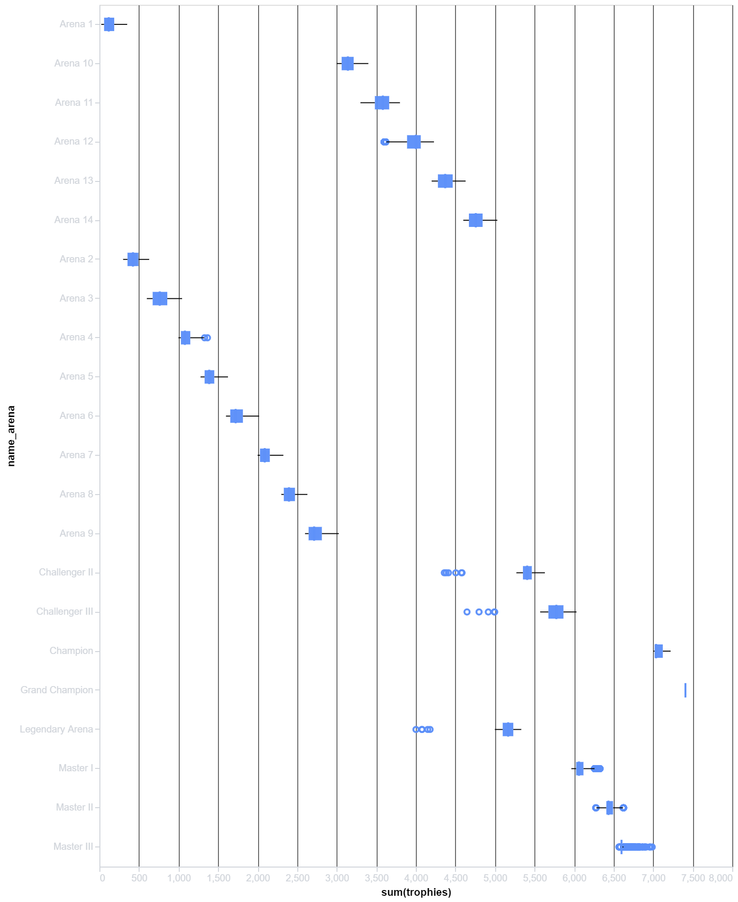

# PyGWalker: Usecases for EDA 

## Tableau Style Interface for Python
PyGWalker is a library that uses that helps in Data Visualization and Exlporatory Data Analysis using a tableau style interface in a jupyter notebook.

## Some Examples of Visualisation

### Scatter Plot

### Bar Plot

### Box Plot

<!-- ### Scatter Plot
 -->

## Advantages
* Can create beautiful plots quicky using user intreface if one is feeling lazy to type some code
* Free to use unlike paid BI softwares
* Easy to implement

## Disadvantages
* One of the key disadvantages is that this libraray failed to operate well with a fairly small data set. Often freezes or takes time to update plots.
* Even thoough I liked the color scheme used in these plots, I could not change or adjust the color of the plots if I have to as per the design language used by the organisation.
* Cannot create custom columns or variables using the interface like in tableau

