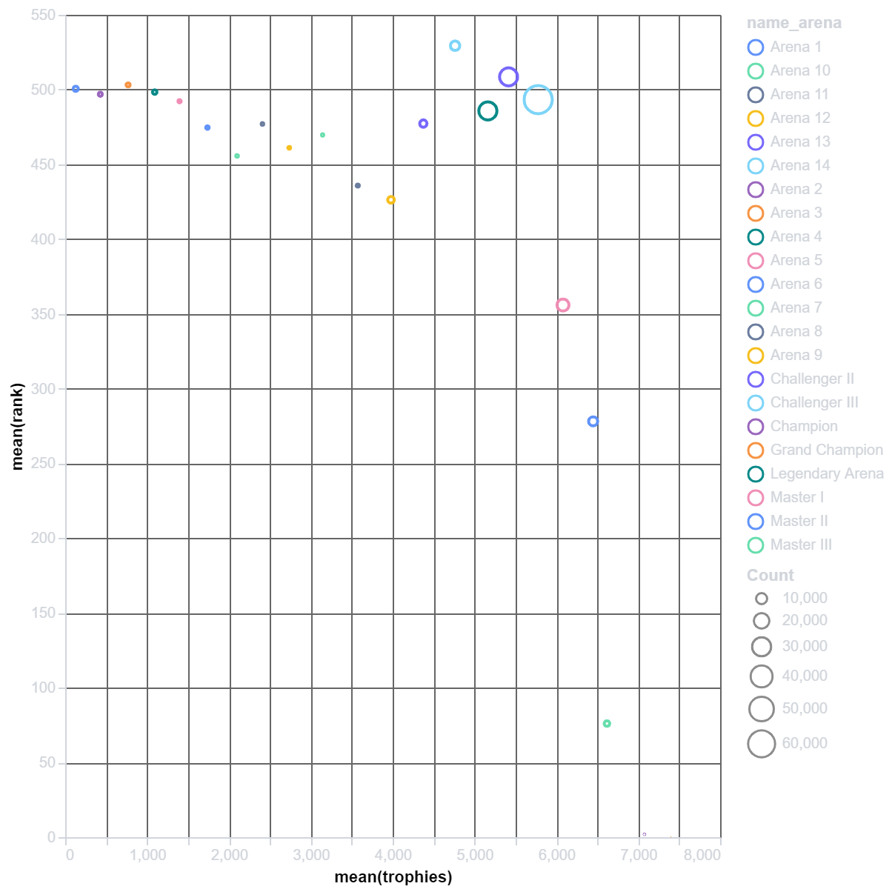
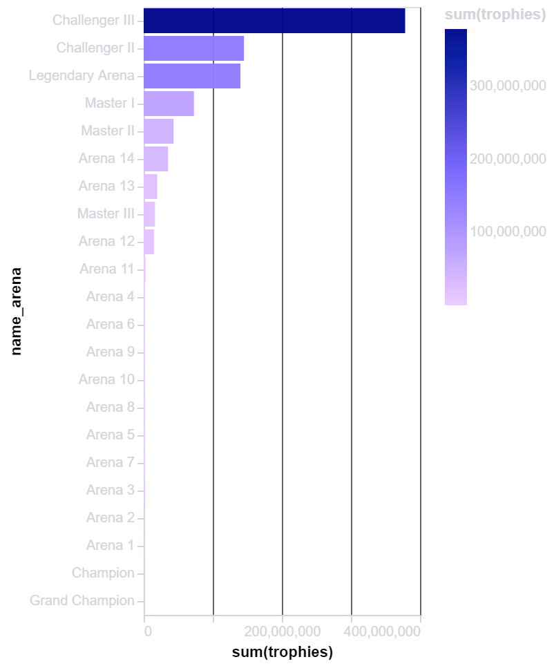

# PyGWalker: Usecases for EDA 

## Tableau Style Interface for Python
PyGWalker is a library that uses that helps in Data Visualization and Exlporatory Data Analysis using a tableau style interface in a jupyter notebook.

## Some Examples of Visualisation

### Scatter Plot

### Bar Plot

<!-- ### Scatter Plot
 -->

